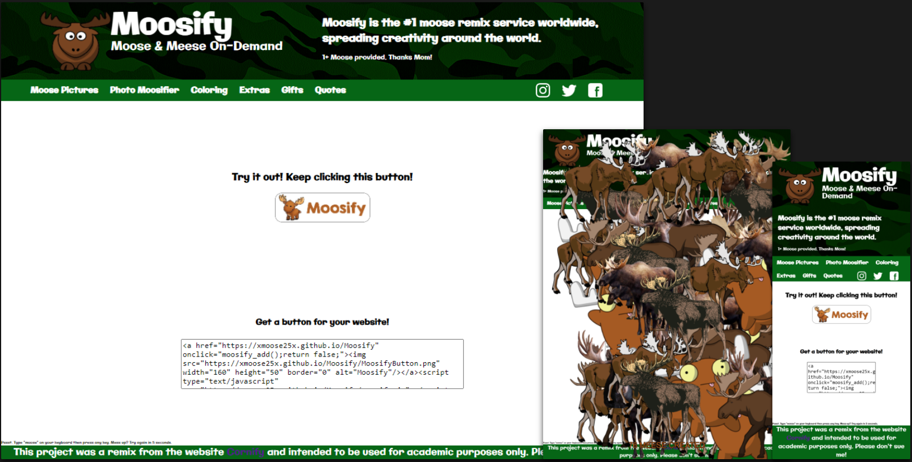

# Moosify

# [Live Site](https://xmoose25x.github.io/Moosify)

Moosify was a project based on the popular website [Cornify](https://www.cornify.com/). 

Just as in the original, my project has the ability to randomly generate image elements onto the screen using JavaScript DOM manipulation. The goal was to remix an existing piece of digital media, so I decided to have moose appear on the screen instead of the usual unicorns and rainbows. I added in a custom button for embedding onto other websites and have the script publicly available for use just like the original.

## Copyright / Attribution Notices
This entire project was based on the work of others.
Here is the list of all known assets, ideas, and intellectual properties that were used in the making of Moosify.
All images were scaled uniformly and have CSS effects rendered upon them within the live site. No other modifications were made.
* [moose-0](./moose-0.png): 
    * [Image Source Link](https://www.nicepng.com/ourpic/u2w7w7t4i1q8a9t4_png-royalty-free-gir-s-by-mattyhex-on/)
    * Stated Usage:
        * > This Png Royalty Free Gir S By Mattyhex On Deviantart Girs - Moose From Invader Zim is high quality PNG picture material, which can be used for your creative projects or simply as a decoration for your design & website content.
* [moose-1](./moose-1.png)
    * [Image Source Link](http://www.pngmart.com/image/65622)
    * Stated Usage:
        * >Image License: ✅ Free for personal use only
* [moose-2](./moose-2.png)
    * [Image Source Link](http://www.pngall.com/moose-png/download/63053)
    * Stated Usage:
        * > License Info: [Creative Commons 4.0 BY-NC](https://creativecommons.org/licenses/by-nc/4.0/)
* [moose-3](./moose-3.png)
    * [Image Source Link](http://www.pngmart.com/image/65628)
    * Stated Usage:
        * > Image License: ✅ Free for personal use only
* [moose-4](./moose-4.png)
    * [Image Source Link](https://www.pngitem.com/middle/iwRhRTo_moose-mount-transparent-moose-hd-png-download/)
    * Stated Usage:
        * > Image License: Personal Use Only
* [moose-5](./moose-5.png)
    * [Image Source Link](https://www.pngaaa.com/detail/2563277)
    * Stated Usage:
        * > License:Non-commercial Use
* [moose-6](./moose-6.png)
    * [Image Source Link](https://toppng.com/transparent-background-moose-clipart-PNG-free-PNG-Images_196523)
    * Stated Usage:
        * >CopyRight : © Free for personal use
* [moose-7](./moose-7.png)
    * [Image Source Link](https://dlpng.com/png/198274)
    * Stated Usage:
        * > License	Free for personal use only
* [moose-logo](./moose-logo.png)
    * [Image Source Link](https://pixabay.com/vectors/elk-animal-brown-mammals-horns-35579/)
    * Stated Usage:
        * > [Pixabay License](https://pixabay.com/service/license/) Free for commercial use No attribution required
* [Moosify Button](./MoosifyButton.png) & [Favicon](./favicon.ico)
    * [Image Source Link](http://clipartmag.com/download-clipart-image#moose-cartoon-drawing-30.jpg)
    * Stated Usage:
        * > [CC BY-NC 4.0 License](https://creativecommons.org/licenses/by-nc/4.0/) ✓ Free for personal use ✓ Attribution required
* [Camo Background](./background.jpg)
    * [Image Source Link](https://pixabay.com/illustrations/texture-camo-soldier-surface-green-2900900/)
    * Stated Usage:
        * > [Pixabay License](https://pixabay.com/service/license/) Free for commercial use No attribution required
* [Konami Code Style "Cheat Code"](./moosify.js)
    * [Source Code Link](http://snaptortoise.github.io/konami-js/)
    * Stated Usage:
        * > [MIT License](https://choosealicense.com/licenses/mit/)
* [Remix Idea and JavaScript Code](./index.html)
    * [Source Code Link](https://www.cornify.com/js/cornify.js)
    * [Original Cornify Website](https://www.cornify.com/)
